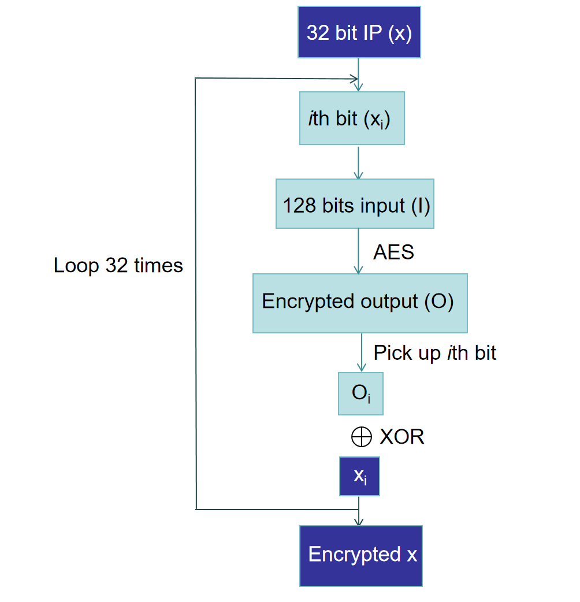

In this update, we implemented the Crypto-PAn encryption algorithm, which can preserve IP address prefixes. The following outlines the operating logic of Crypto-PAn.

Given a 32-bit IPv4 address (x), the reference implementation performs the following operation for each bit (x_i) of the input: Compose a 128-bit input block (I_i = x_[0,i] pad_[i,128]). Encrypt (I_i) with the cipher to produce a 128-bit output block (O_i). Finally, XOR the i-th bit of that output block with the i-th bit of (x), and append the result — (x_i ⊕ O_{i,i}) — onto the output bitstring.

Implementation settings:
1. Git pan folder.
2. Create a new project in vitis_hls
3. Add pan.cpp and pan.h in the design file. Select pan(pan.cpp) in the top function. 
4. Select pan_test.cpp and source_ips.dat in the TestBanch File.
5. Use defult Solution Configuration settings.
6. Run C simulation.

Results analysis:
When the IP prefixes are the same, such as 192.168.0.0/16 and 134.232.0.0/16, the prefixes of the encrypted results are also the same, which is also a major feature of Crypto-PAn. This means that the encryption algorithm has successfully achieved encryption.
To test additional IP addresses, edit source_ip.dat and adjust the SOURCE variable in pan_test.cpp to the desired number of IP addresses.

Results:
source ip: 192.168.2.22
encrypted ip: 205.245.42.52

source ip: 192.168.2.52
encrypted ip: 205.245.42.31

source ip: 192.168.233.123
encrypted ip: 205.245.242.88

source ip: 134.232.87.90
encrypted ip: 185.162.173.230

source ip: 134.232.65.32
encrypted ip: 185.162.180.184

Update_2:
In the pan_vivado folder, there is a Vivado project named pan_viva that focuses on the Crypto_PAN implementation. This project integrates an IP core generated using Vitis.
Currently, the behavioral simulation for this project has been successfully completed. The next step in our work will be to perform RTL simulation to further validate and optimize the design.
